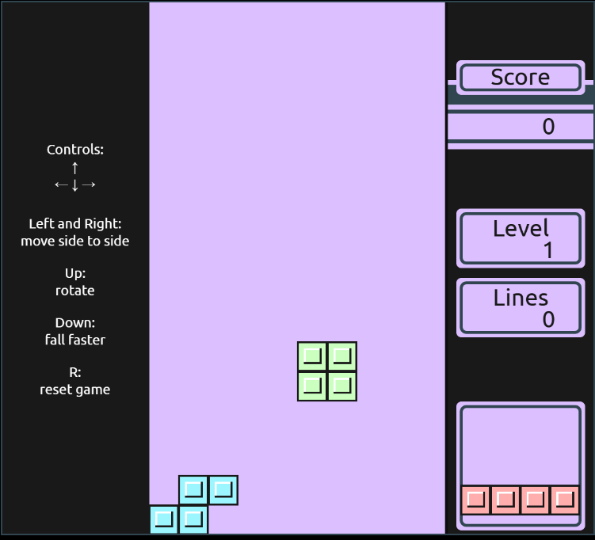

# 🎮 Tetris Game – HTML, CSS, JavaScript
A classic Tetris game built from scratch using only vanilla JavaScript, HTML, and CSS. This project recreates the timeless gameplay experience in the browser, with keyboard controls, score tracking, and increasing difficulty.

## 🕹️ Game Features
* 🔲 Classic Tetris blocks (Tetrominoes)
* ⌨️ Keyboard controls (Arrow keys for movement and rotation)
* 💯 Real-time score tracking
* ⬆️ Increasing speed with level progression
* 🔁 Game over detection and restart functionality
* 🖥️ Fully responsive UI

## 🎯 Controls
| Key	| Action|
|-------|--------|
| ⬅️ Left Arrow | Move piece left |
| ➡️ Right Arrow |	Move piece right |
| ⬇️ Down Arrow	| Move piece down faster |
| ⬆️ Up Arrow | Rotate piece |

## 📷 Screenshot

## 🕹️ Play here
## https://adarshakarki.github.io/Tetris/
